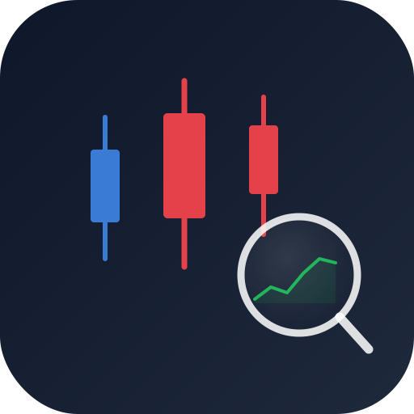

<div align="center">



# StockLens

**AI-powered Korean stock analysis with real data**

[](https://pypi.org/project/stocklens-mcp/)
[](https://www.python.org/downloads/)
[](https://opensource.org/licenses/MIT)

[🇰🇷 한국어](README.md) | 🇺🇸 **English**

</div>

---

## Why StockLens

When you show AI a chart image, it **guesses the numbers and often gets them wrong** (hallucination).

**StockLens** connects Claude directly to live data from Naver Finance (Korea's largest stock portal), so AI **reads real numbers instead of guessing**.

```
❌ "Samsung Electronics is around 80,000 KRW" (guess, wrong)
✅ "Samsung Electronics at 206,000 KRW, +5.3% vs 20-day MA" (real data)
```

## Features

- 📊 **19 tools** — Prices, charts, investor flows, financials, screening, Excel export
- 🔑 **No API key required** — Uses public Naver Finance data
- 🚀 **Fast responses** — TTL cache + Semaphore optimization
- 📁 **Excel snapshots** — Scan once, query instantly
- 🤖 **Gemini/GPT compatible** — Export to Excel for use with other AIs

## Quick Start

> 📌 **Python 3.11+ required.** Check with `py --version` or `python --version`. If older, install 3.12 from [python.org](https://www.python.org/downloads/) (check "Add to PATH").

### Install (3 commands)

Open your terminal (PowerShell / cmd / Terminal):

```bash
py -m pip install stocklens-mcp
py -m stock_mcp_server.setup_claude
py -m stock_mcp_server.doctor
```

1. Install → 2. Configure Claude Desktop → 3. Verify

Then **fully quit and restart Claude Desktop** (tray icon → Quit).

> 💡 On macOS/Linux, use `python3` if `py` isn't available. E.g., `python3 -m pip install stocklens-mcp`

Then **fully quit and restart Claude Desktop**.

## Verify Installation

In Claude:
```
Show me Samsung Electronics (005930) current price
```

If you see the stock name, price, and volume, you're all set.

## Installation Diagnosis

If MCP does not appear in Claude Desktop:

```bash
stocklens-doctor
```

Auto-checks Python / package / command / config in 4 steps. Shows the exact fix command. Send this to anyone having install trouble.

## Example Queries

```
"Analyze SK Hynix 120-day candles using the 20-day MA trend"
"Check Kakao's foreign/institutional investor flow for the last 20 days"
"Find stocks in top-100 market cap with PER under 15"
"Show today's strongest 3 themes and analyze the leader of each"
```

## Learn More

- [📘 **All 19 Tools** →](guides/en/TOOLS.md)
- [💡 **50 Prompt Examples** →](guides/en/USAGE.md)
- [🔧 **Installation & Troubleshooting** →](guides/en/INSTALL.md)

## Supported Environments

| Environment | Support |
|-------------|---------|
| Claude Desktop (app) | ✅ Main target |
| Claude Code (CLI) | ✅ |
| Claude.ai (web) | ❌ Local MCP not supported |
| ChatGPT / Gemini | Via Excel export workaround |

## Important Note for International Users

StockLens is designed for **Korean stock market (KOSPI/KOSDAQ)** data from Naver Finance. Stock codes are 6-digit Korean tickers (e.g., `005930` for Samsung Electronics, `000660` for SK Hynix). US/global stock support is planned for a future version.

## Contributing

Issues and PRs are welcome. Please open an [Issue](https://github.com/Johnhyeon/stocklens-mcp/issues) for bugs or feature requests.

## License

MIT License
