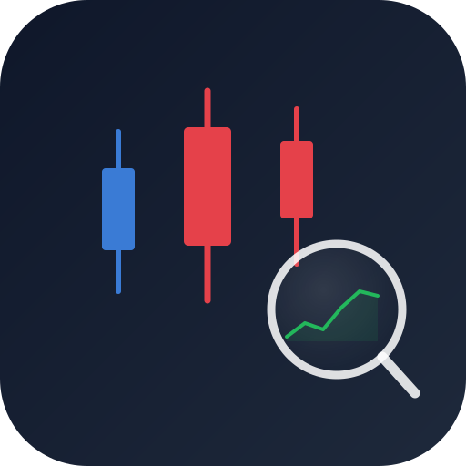

<div align="center">



# StockLens

**AI-powered Korean stock analysis with real data**

[](https://pypi.org/project/stocklens-mcp/)
[](https://www.python.org/downloads/)
[](https://opensource.org/licenses/MIT)

[🇰🇷 한국어](README.md) | 🇺🇸 **English**

</div>

---

## Why StockLens

When you show AI a chart image, it **guesses the numbers and often gets them wrong** (hallucination).

**StockLens** connects Claude directly to live data from Naver Finance (Korea's largest stock portal), so AI **reads real numbers instead of guessing**.

```
❌ "Samsung Electronics is around 80,000 KRW" (guess, wrong)
✅ "Samsung Electronics at 206,000 KRW, +5.3% vs 20-day MA" (real data)
```

## Features

- 📊 **48 tools** — Market calendar, prices, charts, investor flows, financials, screening, Excel export
- 🔑 **No API key required** — Uses public Naver Finance data
- 🚀 **Fast responses** — TTL cache + Semaphore optimization
- 📁 **Excel snapshots** — Scan once, query instantly
- 🤖 **Gemini/GPT compatible** — Export to Excel for use with other AIs

## Quick Start (one line, no Python required)

[`uv`](https://docs.astral.sh/uv/) installs the Python runtime for you. Paste one line into your terminal.

### Windows (PowerShell)

```powershell
powershell -ExecutionPolicy Bypass -c "irm https://raw.githubusercontent.com/Johnhyeon/stocklens-mcp/main/install.ps1 | iex"
```

### macOS / Linux (terminal)

```bash
curl -LsSf https://raw.githubusercontent.com/Johnhyeon/stocklens-mcp/main/install.sh | sh
```

The script handles ① uv install → ② `uv tool install stocklens-mcp` → ③ Claude Desktop config registration → ④ verification. After it finishes, **fully quit Claude Desktop (tray → Quit)** and relaunch.

> 💡 **Response timing**
> - **First run**: downloads package + dependencies from PyPI (10~30s)
> - **Subsequent calls**: 1~2 seconds; instant on cache hit

### Update

```bash
uv tool upgrade stocklens-mcp
```

Or simply re-run the install one-liner.

---

### 🔄 Existing pip users

Removing the old pip install and switching to uv gives you an isolated environment — no more conflicts.

```bash
py -m pip uninstall stocklens-mcp        # Windows
python3 -m pip uninstall stocklens-mcp   # macOS/Linux
```

Then run the install one-liner above. `setup_claude` auto-updates the existing Claude config entry to the new absolute path.

> 📌 Manual install / troubleshooting: [Install guide](guides/en/INSTALL.md)

## Verify Installation

In Claude:
```
Show me Samsung Electronics (005930) current price
```

If you see the stock name, price, and volume, you're all set.

<!-- TODO: screenshot — Claude response example -->


## Installation Diagnosis

```bash
stocklens-doctor
```

Auto-checks uv / package / command / config in 4 steps. Shows the exact fix command. Send this to anyone having install trouble.

## Example Queries

```
"Analyze SK Hynix 120-day candles using the 20-day MA trend"
"Check Kakao's foreign/institutional investor flow for the last 20 days"
"Find stocks in top-100 market cap with PER under 15"
"Show today's strongest 3 themes and analyze the leader of each"
```

> ✅ Only builds that pass full-tool QA and load tests ship to release. ([details](QUALITY.md))

## Learn More

- [📘 **All 48 Tools** →](guides/en/TOOLS.md)
- [💡 **50 Prompt Examples** →](guides/en/USAGE.md)
- [🔧 **Installation & Troubleshooting** →](guides/en/INSTALL.md)

## Supported Environments

| Environment | Support |
|-------------|---------|
| Claude Desktop (app) | ✅ Main target |
| Claude Code (CLI) | ✅ |
| Claude.ai (web) | ❌ Local MCP not supported |
| ChatGPT / Gemini | Via Excel export workaround |

## Market Coverage

- **Korean market (KOSPI/KOSDAQ)** via Naver Finance — 6-digit tickers (`005930` = Samsung Electronics, `000660` = SK Hynix)
- **US market (NYSE/NASDAQ)** via Yahoo Finance — alphabet tickers (`AAPL`, `TSLA`, `BRK.B`)

Tickers are auto-detected; mix freely in natural language (e.g., "compare 005930 and AAPL"). Full tool list in [TOOLS.md](guides/en/TOOLS.md).

## Contributing

Issues and PRs are welcome. Please open an [Issue](https://github.com/Johnhyeon/stocklens-mcp/issues) for bugs or feature requests.

## License

MIT License
